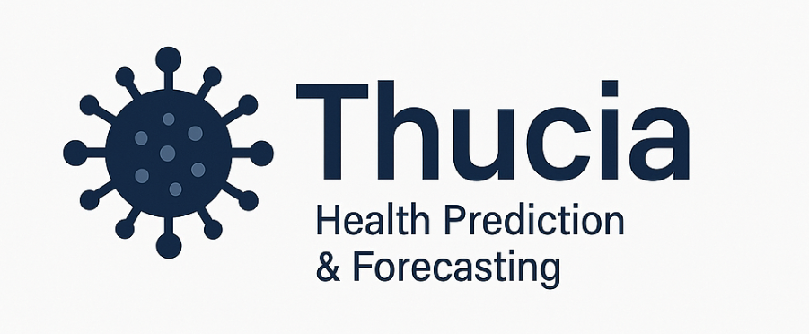

Thucia is an intelligent disease forecasting platform named in homage to the ancient historian _Thucydides_, who chronicled the Plague of Athens.  Just as he gave the world its first clinical record of an epidemic, Thucia brings clarity to modern public health threats through data, modeling, and timely alerts. With a focus on arboviral diseases like dengue, Zika, and chikungunya, Thucia empowers governments, researchers, and health organizations with actionable insight—before outbreaks escalate.
